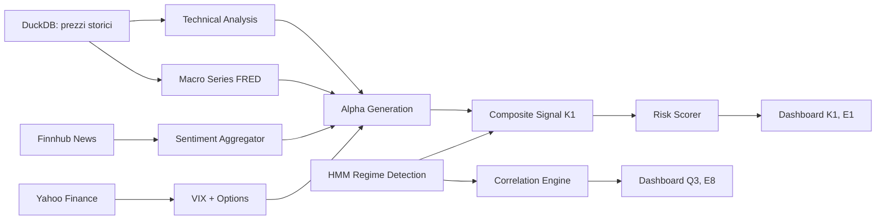

# Market Analysis Engine — Motore di Analisi di Mercato

**Introdotto in:** v10 (Architettura base)
**Ultimo aggiornamento:** v14 (documentazione completa post-analisi vault)
**File principali:** `engine/analytics/`, `engine/alpha_generation/`, `engine/risk/`
**Stato:** Nucleo di analisi quantitativa — distinto dal motore di previsione (forecasting)

---

## Panoramica

Il **Market Analysis Engine** è il cervello analitico di MarketAI. Si occupa di trasformare dati grezzi di mercato in segnali, score di rischio, correlazioni, regimi di mercato e analisi del sentiment. È distinto dal motore di previsione (che produce forecast futuri) — l'engine di analisi descrive e interpreta il **presente e il passato**.

I risultati dell'engine vengono visualizzati nelle pagine E*, K*, M*, Q* e alimentano il Composite Signal (K1).

---

## Architettura dei sottomoduli

```
engine/
├── alpha_generation/           ← Segnali di trading (alpha)
│   ├── macro_signal.py         ← Segnale macro (yield curve, PMI, inflazione)
│   ├── vix_signal.py           ← Segnale VIX (fear gauge)
│   ├── composite_signal.py     ← Aggregazione di tutti i segnali → K1
│   └── yield_curve_signal.py   ← Inversione curva → probabilità recessione
│
├── analytics/
│   ├── sentiment/              ← Aggregazione 8 fonti sentiment
│   │   ├── aggregator.py       ← Composite sentiment score
│   │   └── sources/            ← Fetcher per ogni fonte
│   ├── correlation/            ← DCC-GARCH e correlazioni regime-conditional
│   │   ├── dcc_garch.py
│   │   ├── rolling_correlation.py
│   │   └── network_builder.py  ← Grafi NetworkX
│   ├── technical/              ← Indicatori tecnici su OHLCV
│   ├── pipeline.py             ← Orchestratore pipeline completa
│   ├── labour_market/          ← Claims, JOLTS, Payroll (FRED)
│   └── surprise_engine.py      ← Indice sorpresa economica
│
└── risk/
    ├── risk_scorer.py          ← RiskScore composito con breakdown
    ├── portfolio_risk.py       ← VaR, CVaR, Beta, Sharpe portafoglio
    └── rebalancing_advisor.py  ← Consigli di ribilanciamento
```

---

## Flusso: da dati grezzi a Composite Signal (K1)



---

## Componenti nel dettaglio

### 1. Alpha Generation (`engine/alpha_generation/`)

Produce segnali direzionali su base macro, tecnica e di sentiment.

```python
from engine.alpha_generation.composite_signal import CompositeSignalEngine

engine = CompositeSignalEngine()
signal = engine.compute()
# signal.direction: "bullish" | "bearish" | "neutral"
# signal.conviction: float [0, 1]
# signal.components: dict[str, float]  ← breakdown per componente
# signal.regime: MarketRegime  ← dal HMM
```

Componenti del composite signal e pesi (da `config/operational_defaults.yaml`):
| Componente | Peso default | Fonte dati |
|---|---|---|
| VIX signal | 0.25 | Yahoo Finance (VIX) |
| Yield curve signal | 0.20 | FRED (2Y, 10Y) |
| Macro signal | 0.20 | FRED (600+ serie) |
| Sentiment composite | 0.20 | 8 fonti aggregate |
| Technical signal | 0.15 | Indicatori su OHLCV |

**Regola:** I pesi sono in `OP_CONFIG.analytics.*` — mai hardcoded nel codice.

---

### 2. Sentiment Engine (`engine/analytics/sentiment/`)

Aggrega 8 fonti indipendenti in un composite score [0, 100].

Vedere: [[Sentiment Engine]]

---

### 3. Correlation Engine (`engine/analytics/correlation/`)

Calcola correlazioni tra asset con approcci diversi per regime di mercato.

Vedere: [[Correlation Engine]]

---

### 4. Market Regime Detection

Identifica il regime di mercato corrente tramite Hidden Markov Model (HMM).

Vedere: [[Market Regime]]

---

### 5. Risk Scorer (`engine/risk/risk_scorer.py`)

Produce un RiskScore composito con breakdown obbligatorio (anti-pattern: RiskScore senza breakdown).

```python
from engine.risk.risk_scorer import RiskScorer

scorer = RiskScorer()
score = scorer.compute(portfolio_data, market_context)
# score.total: float [0, 1]  ← 0 = minimo rischio, 1 = massimo rischio
# score.breakdown: {
#     "market_risk": 0.35,       ← correlato a VIX e regime
#     "credit_risk": 0.20,       ← spread HY vs IG
#     "liquidity_risk": 0.15,    ← volume, bid-ask
#     "concentration_risk": 0.30 ← Herfindahl index sul portafoglio
# }
```

**Regola anti-pattern:** `❌ RiskScore senza breakdown → componenti sempre esposti`

---

### 6. Analysis Pipeline Orchestrator (`engine/analytics/pipeline.py`)

Esegue la pipeline di analisi completa coordinando tutti i sottomoduli.

```python
from engine.analytics.pipeline import AnalysisPipeline

pipeline = AnalysisPipeline()
result = await pipeline.run(tickers=["AAPL", "MSFT", "SPY"])
# Sequenza interna:
#   1. Fetch prezzi via ProviderRegistry
#   2. Clean + validate (DataCleaner + Pandera)
#   3. Technical analysis
#   4. Sentiment aggregation
#   5. Regime detection (HMM)
#   6. Correlation update (DCC-GARCH)
#   7. Risk scoring
#   8. Composite signal computation
#   9. Alert check
#   10. Persist su DuckDB
# Target: < 10s per 10 ticker (pytest-benchmark)
```

**Scheduling:** la pipeline viene eseguita ogni 4h nei giorni lavorativi tramite APScheduler.

---

## Separazione da Personal Layer

L'engine di analisi di mercato è **completamente separato** dal layer Personal (finanza personale dell'utente). La comunicazione avviene **solo tramite Bridge**:

```python
# bridge/api_contracts.py
class MarketContextForPersonal(BaseModel):
    """Dati di mercato passati all'Personal layer."""
    risk_free_rate: float
    equity_expected_return: float
    equity_volatility: float
    inflation_rate: float
    current_regime: str           # "bull" | "bear" | "transition" | "stress"
    vix: float
```

**Regola:** `engine/` NON importa da `personal/` e viceversa. Solo via `bridge/`.

---

## Scheduling e refresh dati

| Job | Frequenza | Trigger manuale |
|---|---|---|
| Pipeline completa (10+ ticker) | Ogni 4h giorni lavorativi | E11 Analysis Pipeline → "Refresh" |
| Labour Market (FRED) | Settimanale | M3 → "📥 Carica da FRED" |
| Economic Surprise | Mensile | M5 → "📥 Carica consensus" |
| Sentiment aggregation | Ogni ora | Automatico via WebSocket Finnhub |
| Backup DuckDB | Ogni notte alle 02:00 | Management UI → "💾 Backup" |

---

## Metriche di qualità e osservabilità

Ogni modulo dell'engine registra metriche tramite `shared/metrics.py`:

```python
# Metriche automaticamente raccolte
fetch_latency_ms{source, ticker}    ← latenza per fonte dati
pipeline_duration_ms{stage}         ← durata ogni stage della pipeline
sentiment_composite_score           ← score sentiment aggregato
regime_current                      ← regime HMM corrente (0-3)
data_quality_score{series_id}       ← quality score per serie
```

Se `error_rate` > 10% in 5 minuti → lo scheduler si auto-sospende (Regola 30).

---

## File .claude/ pertinenti

```
@.claude/02_architecture.md   ← struttura directory completa engine/
@.claude/07_data_pipeline.md  ← pipeline fetch→clean→validate→duckdb
@.claude/03_conventions.md    ← regole (RiskScore breakdown, 3+ fonti sentiment, ecc.)
```

---

## Pagine dashboard associate

| Modulo engine | Pagine dashboard |
|---|---|
| Alpha Generation / Composite Signal | K1 |
| Sentiment Engine | E7, Q5 |
| Correlation Engine | E8, Q3 |
| Market Regime (HMM) | E1 (badge), K1, Q3 |
| Risk Scorer | E1 (top risk factors), P2 (portfolio risk) |
| Analysis Pipeline | E11 |
| Labour Market | M3, Q9 |
| Economic Surprise | M4, M5, Q10 |
| VIX | M1, E5 |
| Yield Curve | M2, E3 |

---

## Collegamenti

- [[Engine Overview]] — panoramica del layer
- [[Sentiment Engine]] — dettaglio 8 fonti sentiment
- [[Correlation Engine]] — DCC-GARCH e network
- [[Market Regime]] — HMM regime detection
- [[Risk Scoring]] — RiskScore con breakdown
- [[Data Flow]] — flusso dati end-to-end
- [[Forecasting Engine Map]] — motore di previsione (distinto da questo)
