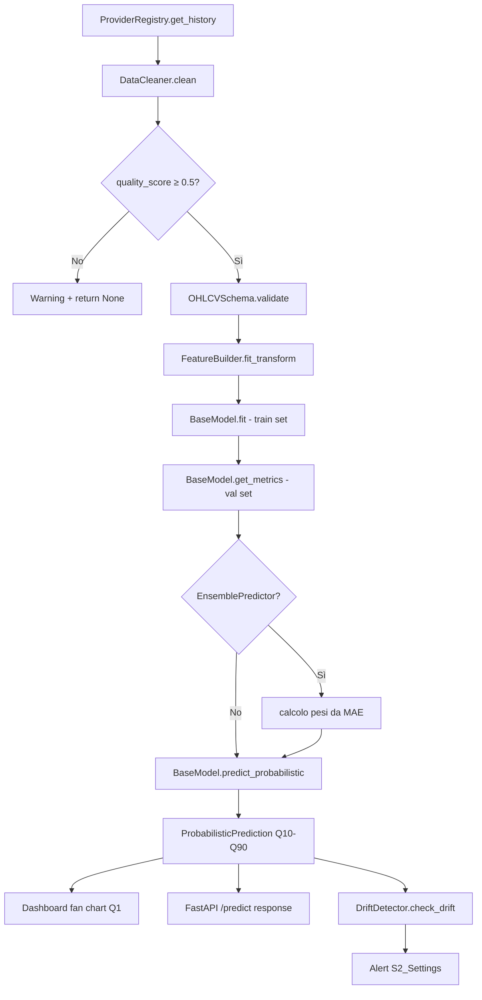

# Forecasting Engine Map

**Introdotto in:** v13 (documentazione aggiornata post-analisi vault)
**Scopo:** Mappa delle relazioni tra tutti i moduli del sistema di previsione
**Stato:** Documento di riferimento architetturale — leggere prima di modificare qualsiasi modulo forecasting

---

## Panoramica: il sistema di previsione come pipeline

Il motore di previsione di MarketAI trasforma dati OHLCV storici in distribuzioni probabilistiche future. È composto da 5 strati distinti che devono essere attraversati in ordine.

```
STRATO 1 — ACQUISIZIONE
  ProviderRegistry.get_history(symbol, start, end)
      └── YFinanceProvider (priorità 1)
      └── AlphaVantageProvider (priorità 2, fallback)
      └── FinnhubProvider (priorità 3, fallback)

STRATO 2 — PREPARAZIONE DATI
  DataCleaner.clean(df_raw)
      └── Gap filling, outlier detection, stale check
  DataQualityReport.generate(df_clean)
      └── quality_score [0,1] — se < 0.5 → warning, non procedere
  OHLCVSchema.validate(df_clean)
      └── Pandera: tipi, range, UTC, no object dtype

STRATO 3 — FEATURE ENGINEERING
  FeatureBuilder.fit_transform(df_validated, target_col="Close")
      └── auto_features=True  → lag, rolling, Fourier + selezione (max 50)
      └── auto_features=False → configurazione manuale (retrocompatibile)

STRATO 4 — MODELLI
  BaseModel.fit(train_df)          ← interfaccia comune a tutti i modelli
      ├── ARIMAModel               (statistico, sempre disponibile)
      ├── ProphetModel             (statistico, sempre disponibile)
      ├── XGBoostModel             (ML, quantile nativa Q10-Q90)
      ├── RandomForestModel        (ML, quantile via sklearn)
      ├── NBeatsModel              (DL, CPU-only, feature flag + RAM check)
      └── EnsemblePredictor        (combina i precedenti, feature flag)
              └── strategy: simple_average | weighted | stacking

STRATO 5 — OUTPUT
  BaseModel.predict(horizon)                   → pd.Series (mediana)
  BaseModel.predict_probabilistic(horizon)     → ProbabilisticPrediction
      └── dates, q10, q25, q50, q75, q90
      └── .to_dataframe()                      → pronto per Plotly fan chart
```

---

## Flusso completo training + inference



---

## Tabella: quale modello implementa cosa

| Metodo | ARIMA | Prophet | XGBoost | RF | N-BEATS | Ensemble |
|---|---|---|---|---|---|---|
| `fit()` | ✅ | ✅ | ✅ | ✅ | ✅ | ✅ |
| `predict()` | ✅ | ✅ | ✅ | ✅ | ✅ | ✅ |
| `predict_probabilistic()` | ⚠️ fallback¹ | ⚠️ fallback¹ | ✅ nativa | ✅ nativa | ⚠️ fallback¹ | ✅ combinata |
| `get_metrics()` | ✅ | ✅ | ✅ | ✅ | ✅ | ✅ |
| Feature flag | ❌ | ❌ | ❌ | ❌ | ✅ `nbeats_model` | ✅ `ensemble_predictor` |
| RAM check | ❌ | ❌ | ❌ | ❌ | ✅ ≥ 4GB | ❌ |
| GPU | ❌ | ❌ | ❌ | ❌ | CPU only | ❌ |

¹ *fallback = `ProbabilisticPrediction.from_point_forecast()` con ±10% banda simmetrica*

---

## Regola: quando usare quale modello

```
Primo test rapido su nuovo ticker          → ARIMA (veloce, zero tuning)
Serie con forte stagionalità               → Prophet
Performance ML su serie stazionarie       → XGBoost (quantile nativa)
Ensemble di default (produzione)           → ensemble_weighted
Serie con struttura DL (lungo storico)    → NBeats (solo se RAM ok + feature flag)
Confronto baseline vs naive               → Theil's U2 su tutti i modelli
```

---

## Interdipendenze tra moduli (cosa importa cosa)

```
model_registry.py
    ← base_model.py            (ABC che i modelli implementano)
    ← feature_flags.py         (controllo disponibilità)
    ← nbeats/ram_check.py      (controllo RAM per N-BEATS)

base_model.py
    → probabilistic_prediction.py  (output standardizzato)
    ← feature_builder.py           (usato da XGBoost/RF per feature)

ensemble_predictor.py
    ← base_model.py                (eredita da BaseModel)
    ← [lista modelli base]         (passati nel costruttore)
    → probabilistic_prediction.py  (output combinato)

evaluation/advanced_metrics.py
    ← probabilistic_prediction.py  (input per CRPS, Pinball)
    → drift_detector.py            (metriche alimentano il drift check)
```

---

## Persistenza risultati forecasting

| Dato | Dove | Tabella |
|---|---|---|
| Metriche modello (MAE, RMSE, MAPE) | SQLite `user_sessions.db` | `model_metrics` (v15) |
| Backtest results | DuckDB | `backtest_results` |
| Feature importance (SHAP) | In-memory / visualizzazione | Non persistita |
| Sessione analisi (symbol, modello, periodo) | SQLite `user_sessions.db` | `analysis_sessions` (v15) |

---

## Aggiungere un nuovo modello — Checklist

```
□ 1. Creare file in engine/analytics/forecasting/<nome_modello>.py
□ 2. Ereditare da BaseModel e implementare: name, fit(), predict()
□ 3. Se supporta quantili nativa: override predict_probabilistic()
□ 4. Se ha requisiti hardware/feature: aggiungere guard in fit()
□ 5. Aggiungere a ModelRegistry nell'init dell'app
□ 6. Aggiungere a config/feature_flags.yaml se sperimentale
□ 7. Scrivere test in tests/engine/forecasting/test_<nome>.py
□ 8. Aggiornare questa mappa e Model Registry.md
□ 9. pytest -m regression → 0 failed
```

---

## Performance target (hardware Ryzen 5 5600)

| Operazione | Target | Note |
|---|---|---|
| ARIMA fit (5 anni daily) | < 10s | auto_arima può essere lento su serie lunghe |
| XGBoost fit 5 quantili (10 anni) | < 30s | CPU, tree_method="hist" |
| EnsemblePredictor fit (3 modelli) | < 60s | somma dei fit individuali |
| N-BEATS fit (hidden=128, 500 punti) | < 3 min | CPU, batch_size=32 |
| predict_probabilistic qualsiasi modello | < 5s | inferenza molto più veloce del training |
| ProbabilisticPrediction.to_dataframe() | < 100ms | sempre |

---

## Collegamenti

- [[BaseModel Interface]] — contratto che ogni modello deve rispettare
- [[Model Registry]] — come i modelli vengono registrati e acceduti
- [[Ensemble predictor]] — dettaglio delle 3 strategie di combinazione
- [[N-Beats]] — implementazione DL CPU-only con vincoli hardware
- [[Feature Builder]] — pipeline feature engineering usata da XGBoost/RF
- [[Probabilistic Prediction]] — formato output unificato Q10-Q90
- [[Advanced Metrics]] — come valutare le previsioni (SMAPE, CRPS, ecc.)
