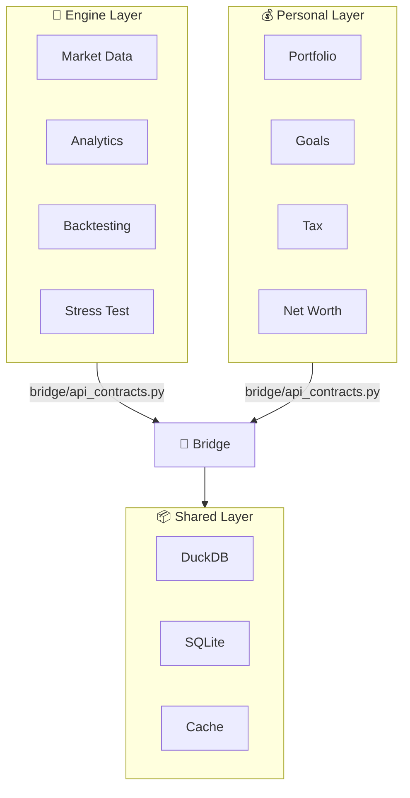

# Market Analysis AI · v6.0

A professional-grade dual-layer Python platform combining quantitative
market analysis and personal finance management.

## Two Dashboards in One System

=== "🔬 Engine Layer"
    Quantitative market analytics:

    - **Market data**: Yahoo, FRED (600+ series), SEC EDGAR, Finnhub, Alpha Vantage
    - **Analysis**: technical indicators, fundamentals, sentiment (8 sources),
      correlations (DCC-GARCH-lite), regime detection (HMM-lite)
    - **Backtesting**: VectorBT-compatible engine with walk-forward + commissions
      + slippage + look-ahead bias prevention
    - **Stress testing**: 4 historical scenarios (GFC, COVID, Rate Hike '22,
      Dot-Com) + 6 forward-looking synthetic scenarios
    - **Forecasting**: 3-scenario projections (pessimistic/base/optimistic)
    - **Pipeline**: end-to-end orchestrator with composite risk score

=== "💰 Personal Layer"
    Your finances, profile-driven:

    - **Investor Profile**: filters ALL suggestions (Rule 22)
    - **Wealth Scenarios**: Monte Carlo 10k simulations < 3s
    - **Cash Flow**: 12-month projection, recurring entries
    - **Net Worth**: assets + liabilities timeline
    - **Goals**: SMART goals + feasibility checker
    - **Tax**: Italian regime (26% capital gains, 12.5% govt bonds)
    - **FIRE Calculator**: retirement age + probability

## Key Numbers

| Metric | Value |
|---|---|
| Source files (mypy strict) | 156 |
| Tests passing | 592+ |
| Coverage | ≥ 80% globally, 94%+ analytics |
| Pipeline latency | 45ms on 5 tickers |
| Monte Carlo 10k sim | < 3s |
| Stress test (10 scenarios) | < 30s |

## Architecture in One Diagram

## Next Steps

- [Quickstart in 5 minutes →](getting-started/quickstart.md)
- [The 32 Conventions →](reference/conventions.md)
- [Architecture Overview →](architecture/overview.md)
